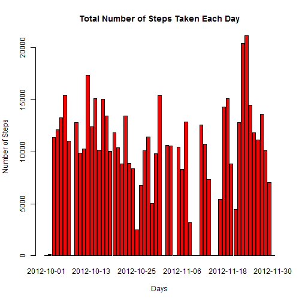
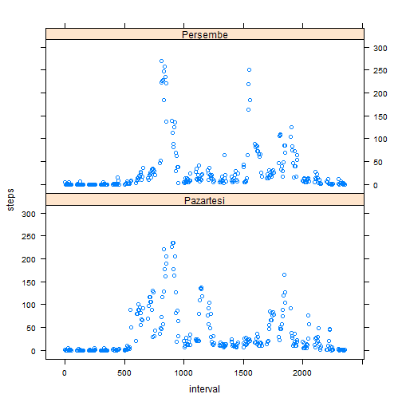

# 1- Reading the data

First we need to read the data. For that we will use read.csv command.


```r
walkingdata <- read.csv("activity.csv", header = TRUE, stringsAsFactors = FALSE)
head(walkingdata)
```

```
##   steps       date interval
## 1    NA 2012-10-01        0
## 2    NA 2012-10-01        5
## 3    NA 2012-10-01       10
## 4    NA 2012-10-01       15
## 5    NA 2012-10-01       20
## 6    NA 2012-10-01       25
```

```r
class(walkingdata$date)
```

```
## [1] "character"
```

Our date classed as character. We need to convert it to date format. For that we enter the code below:


```r
walkingdata$date <- as.Date(walkingdata$date,"%Y-%m-%d")

class(walkingdata$date)
```

```
## [1] "Date"
```

Now our date colon is formatted as Date.

# 2- Histogram of total number of steps taken each day

Next we are going to use tapply func. and make a barplot 


```r
barplot(tapply(walkingdata$steps, walkingdata$date, sum, na.rm=T), xlab = "Days", ylab = "Number of Steps", main = "Total Number of Steps Taken Each Day", col = "red")
```



#3- Mean and median number of steps taken each day

We will show mean and median data side by side


```r
par(mfrow = c(1,2), mar =c(4,4,2,1))
barplot(tapply(walkingdata$steps, walkingdata$date, mean, na.rm=T),col = "purple",xlab = "Days", ylab = "Mean", main = "Mean of Number of Steps")
barplot(tapply(walkingdata$steps, walkingdata$date, median, na.rm=T), col = "grey", xlab = "Days", ylab = "Median", main = "Median of Number of Steps")
```


As we can see, median data is 0. This is because median checks for frequency in the data. 0 steps has the highest frequency for interval for all days.

#4- Average number of steps taken - Time Series


```r
stepstaken <- tapply(walkingdata$steps, walkingdata$date, mean, na.rm=T)
plot(unique(walkingdata$date), stepstaken, col = "blue", pch=19, ylab = "Total Steps Taken", xlab = "Days", main = "Average Number of Steps Taken")
```


#5- 5 minute interval plot

I will use tapply again 


```r
fiveminute1 <- aggregate(steps ~ interval, data = walkingdata, FUN = "mean")

fiveminute2 <- tapply(walkingdata$steps, walkingdata$interval, mean, na.rm = TRUE)

plot(unique(walkingdata$interval), fiveminute2, col = "green", pch=19, ylab = "Total Steps Taken", xlab = "Days", main = "Average Number of Steps Taken", type = "l")

points(fiveminute1$interval[which.max(fiveminute1$steps)], fiveminute1[fiveminute1$interval == fiveminute1$interval[which.max(fiveminute1$steps)],]$steps, col = "red", pch = 19)
```


```r
# Highest value in the graph
fiveminute1[fiveminute1$interval == fiveminute1$interval[which.max(fiveminute1$steps)],]$steps
```

```
## [1] 206.1698
```


#6- Missing Values


```r
# number of NA values in steps column
sum(is.na(walkingdata$steps))
```

```
## [1] 2304
```

```r
#checking if we can use date for imputing missing values - seems we cannot because everyday which has NA in it is full NA values. 
# tapply(walkingdata$steps, walkingdata$interval, anyNA)
# this is why we gonnna use interval values to impute
head(tapply(walkingdata$steps, walkingdata$interval, mean, na.rm=T))
```

```
##         0         5        10        15        20        25 
## 1.7169811 0.3396226 0.1320755 0.1509434 0.0754717 2.0943396
```

```r
#for example we use 1.7169811 value to change all NA values for step 0 and so on.
# I wrote a for loop to achieve this. All NA values replaced with the mean values of the corresponding intervals.
deneme3 <- aggregate(steps ~ interval, data = walkingdata, FUN = "mean")

for (i in seq(0, max(walkingdata$interval), 5)){
  
  walkingdata$steps[walkingdata$interval == i][is.na(walkingdata$steps[walkingdata$interval == i])] <- deneme3$steps[deneme3$interval == i]
  
}

#Here we can see no NA values and previously in head of the walkingdata all the interval values of the six column was NA. Now they all changed individually with the corresponding interval mean steps values. 

sum(is.na(walkingdata))
```

```
## [1] 0
```

```r
head(walkingdata)
```

```
##       steps       date interval
## 1 1.7169811 2012-10-01        0
## 2 0.3396226 2012-10-01        5
## 3 0.1320755 2012-10-01       10
## 4 0.1509434 2012-10-01       15
## 5 0.0754717 2012-10-01       20
## 6 2.0943396 2012-10-01       25
```

```r
# Here we plot mean and median of number of steps

par(mfrow = c(1,2), mar =c(4,4,2,1))
barplot(tapply(walkingdata$steps, walkingdata$date, mean, na.rm=T),col = "purple",xlab = "Days", ylab = "Mean", main = "Mean of Number of Steps")
barplot(tapply(walkingdata$steps, walkingdata$date, median, na.rm=T), col = "grey", xlab = "Days", ylab = "Median", main = "Median of Number of Steps")
```


As we can see there are some median values and their values are a little bit over 30. This is because in previous code we put the same mean values into the same intervals. So by doing this we also put the some of the same values into the same days. This is why some of the days have the same median value.

Our mean histogram plot is also a little bit different from the previous one. Some of the lower values are higher as we expected. 

#7- Weekdays and Weekend

It is a bit longer way but I feel tired and only come up with that solution for creating weekday and weekend values.


```r
library(dplyr)
deneme <- mutate(walkingdata, days = weekdays(walkingdata$date))

deneme$days[deneme$days == "Monday" | deneme$days == "Tuesday" | deneme$days == "Wednesday" | deneme$days == "Thursday" | deneme$days == "Friday"] <- "weekday"

deneme$days[deneme$days == "Saturday" | deneme$days == "Sunday"] <- "weekend"


a <- aggregate(steps ~ interval + days, data = deneme, FUN = "mean")

library(lattice)
xyplot( steps ~  interval | days, data = a, layout = c(1, 2))
```



```r
# I dont know why it divides the plot for every single day. But it does. It dosent show the graph like this in my own plot screen.
```
